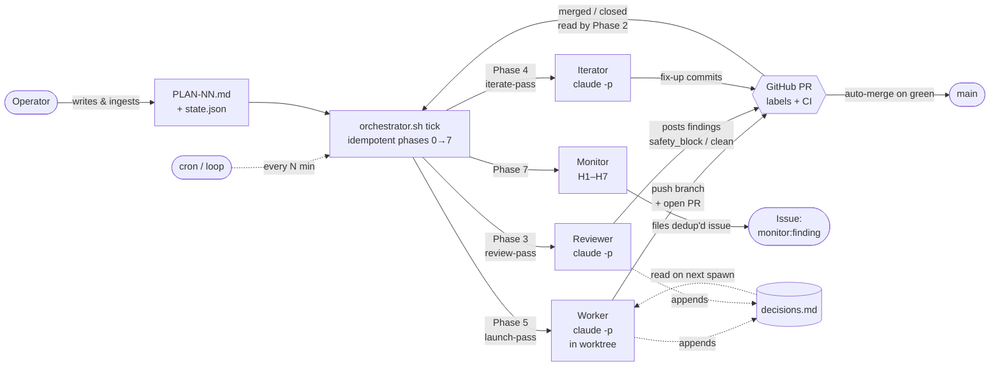

# claudecode-automation

**Status: v0.1 — early; expect sharp edges.** See [PLAN-01-community-readiness](orchestrator-kit/docs/PLAN-01-community-readiness.md) for the roadmap.

Autonomous Claude Code orchestrator that executes superpower-style implementation plans task-by-task with pre-push review and conditional auto-merge.

## Prerequisites

Before installing, you need:

- **Claude Max subscription** with `claude` CLI authenticated (`claude /login`). Workers run via `claude -p` and burn Max-plan quota per task. Without Max, the per-task cost is prohibitive.
- **`gh` CLI authenticated** (`gh auth login`) with a token scoped to the target repo. The kit opens PRs, manages labels, and reads PR review state via `gh`.
- **`gawk`, `jq`, `python3`, `git`** — non-optional. `gawk` (not BSD awk) is specifically required because the plan parser uses `match($0, regex, array)` which BSD awk silently no-ops. `brew install gawk jq` on macOS.
- **`gtimeout` (recommended)** — `brew install coreutils` on macOS. Without it, runaway workers can't be timeboxed.
- **`pr-review-toolkit` plugin** — `claude plugin install pr-review-toolkit` in the target repo. The reviewer runs as a multi-agent coordinator that dispatches the toolkit's specialists (`code-reviewer`, `silent-failure-hunter`, `comment-analyzer`, `pr-test-analyzer`, `type-design-analyzer`) plus `/security-review` in parallel. Without it, the reviewer degrades to an inline single-agent review — still gates merge, weaker signal.
- **GitHub repo with `main` branch and branch protection** allowing auto-merge. The kit's safety model depends on branch protection blocking direct pushes to main.
- **macOS or Linux.** Windows is unsupported.

## Security

> Workers run with `--permission-mode bypassPermissions` — they can run arbitrary Bash, modify any file, and call any tool your `gh` token can reach. **Read [SECURITY.md](SECURITY.md) before installing.**

## What this is NOT

- An interactive coding assistant — use Claude Code directly for that.
- A Devin alternative — Devin is a hosted SaaS agent platform with a GUI. This is a Bash kit that runs in your terminal and on your GitHub repo, against your own Max plan.
- A drop-in CI agent — installation requires repo-level setup (branch protection, labels, `.claude/` directory, optionally cron). The orchestrator runs on its own schedule, not on PRs.

## What's included

- **Autonomous worker loop** — `orchestrator.sh` ticks a fixed phase sequence, spawning one fresh `claude -p` worker per ready task into its own git worktree.
- **Pre-push multi-agent reviewer** — `review-pr.sh` runs as a coordinator that fans out to the `pr-review-toolkit` specialists (`code-reviewer`, `silent-failure-hunter`, `comment-analyzer`, `pr-test-analyzer`, `type-design-analyzer`) and `/security-review` in parallel, then synthesizes their findings into a single JSON verdict. `safety_block` findings hold the task in `in_review` until a human acts; everything else flows through the iterate loop.
- **Opinionated worker prompts** — workers and iterators are wired to `superpowers:verification-before-completion` (run lint/tests before claiming done), `superpowers:test-driven-development`, `superpowers:systematic-debugging`, `superpowers:receiving-code-review`, and the `context7` MCP for library docs. Each addresses a specific orchestrator failure mode rather than being decorative.
- **Conditional auto-merge** — sensitive tasks flagged at ingest time (`auto_merge_overrides`) skip `--auto` and wait for a human; everything else merges on green.
- **Monitor agent** — Phase 7 heuristics (H1–H7) file `monitor:finding` issues for failure patterns that would otherwise stay silent: stuck PRs, silent block, slow plans, reviewer flake, deadlock, test-fail PRs, sensitive-decisions audits.
- **Local dashboard** *(optional)* — read-only Flask UI at `127.0.0.1:5174` showing plan status, log tail, GH issues/PRs, active workers, and effective config. Per-task cost/token tracking included.
- **Plan-authoring helpers** — `/plan-format` slash command and `plan-author` skill produce strict-format plans that `ingest-plan.sh` accepts.
- **Kit upgrades** — `kit-upgrade.sh` is a manifest+hash drift detector with atomic apply, so partial-upgrade footguns don't strand the loop.

## How it works

Every worker, reviewer, and iterator is a **fresh `claude -p` invocation** — no session resume, no shared memory. Continuity across tasks comes from on-disk state (`state.json`, `decisions.md`) plus what the orchestrator re-injects into each prompt. One tick is the unit of progress; nothing happens between ticks except CI on GitHub.

## Installation and usage

See [`orchestrator-kit/README.md`](orchestrator-kit/README.md) for install instructions, the v2 state schema, and per-tick architecture. The plan-authoring helpers (`/plan-format` slash command + `plan-author` skill) are documented there too.

A minimal runnable example is in [`orchestrator-kit/examples/`](orchestrator-kit/examples/) — start there if you want to see the kit run end-to-end before reading the architecture docs.

## License

[MIT](LICENSE). Copyright (c) 2026 weclaudecode.
