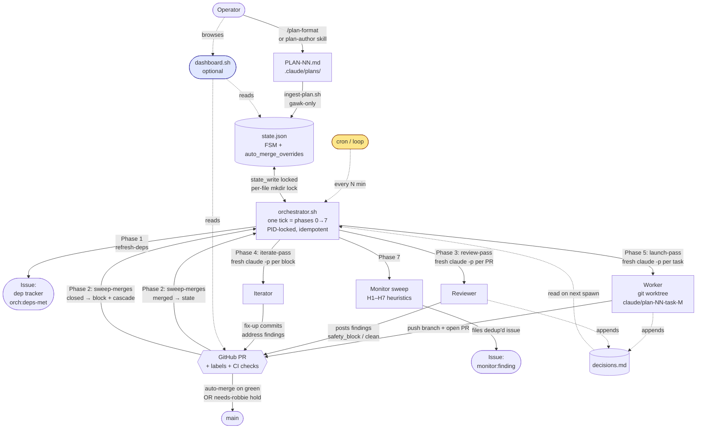
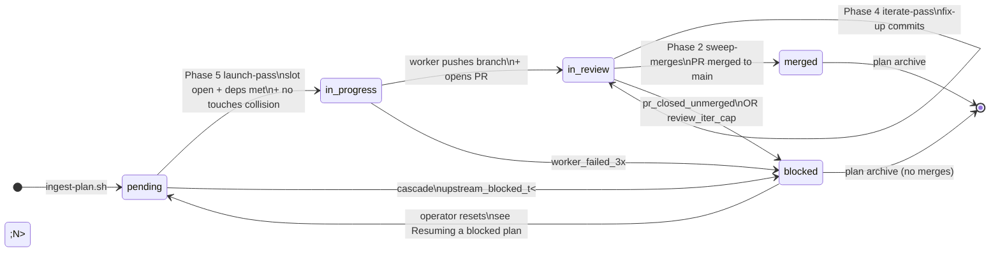

# Claude Code Plan Orchestrator

Autonomous loop that executes superpower-style plans task-by-task with
pre-push review and conditional auto-merge.

## Prerequisites

- macOS or Linux
- `claude` CLI authenticated with your Max plan (`claude /login`)
- `gh` CLI authenticated (`gh auth login`)
- `jq`, `git`
- **`gawk`** (GNU awk) — required. BSD awk silently no-ops the array-capture
  syntax used by the sensitive-pattern detector, so without gawk every plan
  ingests with `auto_merge_overrides: {}` and IAM/migration tasks would
  auto-merge.
- **`pr-review-toolkit` plugin** — required. The reviewer (`review-pr.sh`)
  runs as a multi-agent coordinator that dispatches the toolkit's six
  specialist subagents (`code-reviewer`, `silent-failure-hunter`,
  `comment-analyzer`, `pr-test-analyzer`, `type-design-analyzer`, plus
  `/security-review`) in parallel. Without the plugin installed in the
  target repo, the reviewer degrades to an inline review (still functional,
  weaker signal). Install with `claude plugin install pr-review-toolkit`.
- A GitHub repo with `main` branch and branch protection allowing `--auto` merges
- Optional: cron / launchd for scheduled triggers
- **`python3 >= 3.11` + `PyYAML`** — required. `ingest-plan.sh` shells out to `python3 -c 'import yaml'` to parse `---` plan frontmatter (the `aws:`, `env:`, `requires:`, `pre_flight:` keys added in PLAN-05). Install with `pip install pyyaml`. Also used by the dep-cycle detector and the optional [local dashboard](docs/DASHBOARD.md).

```bash
brew install gh jq gawk     # macOS — gawk is required
# Linux:  apt-get install gh jq gawk  (or distro equivalent)
# claude install: see https://docs.claude.com/en/docs/claude-code/setup
```

### Enable repo-level auto-merge (required)

`gh pr merge --auto` only works when the repo has `allow_auto_merge=true`.
Some `gh` versions accept `gh repo edit --enable-auto-merge` and exit 0
without actually flipping the flag, which leaves the orchestrator stuck on
every PR. Use the API directly and assert the result:

```bash
gh api "repos/<owner>/<repo>" -X PATCH -f allow_auto_merge=true \
  --jq '.allow_auto_merge' | grep -qx true \
  || { echo "allow_auto_merge did not enable" >&2; exit 1; }
```

After install, run `.claude/scripts/check-preconditions.sh` from the target
repo — it verifies branch protection, required checks, and
`allow_auto_merge` together and exits non-zero if any of them are off.

## Install into a repo

From your repo root:

```bash
# Copy this kit into the repo
cp -r /path/to/this/kit/.claude .
cp /path/to/this/kit/orchestrator.sh .
cp /path/to/this/kit/CLAUDE.md .   # only if you don't already have one — review carefully

# Also copy the canonical format spec — /plan-format and plan-author skill read it
mkdir -p .claude/docs
cp /path/to/this/kit/docs/PLAN-FORMAT.md .claude/docs/PLAN-FORMAT.md

chmod +x orchestrator.sh
chmod +x .claude/hooks/*.sh
chmod +x .claude/scripts/*.sh

# Add to .gitignore
cat >> .gitignore <<'EOF'

# Claude Code orchestrator runtime state
.claude/state/orchestrator.lock/
.claude/state/run-*.json
.claude/state/post-merge-pr*.log
.claude/state/active_worktrees.txt
.claude/state/dashboard.pid
.claude/state/dashboard-venv/
.claude/state/dashboard.log
.claude/state/events.jsonl
.claude/state/events.jsonl.*
EOF
```

Then customize:

1. Edit `CLAUDE.md` — your stack, conventions, must-rules
2. Edit `.claude/defaults.md` — your "when in doubt" rules
3. Optionally edit `.claude/state/decisions.md` to seed prior decisions

## Authoring plans

Two helpers create or import plans in the strict
[`PLAN-FORMAT.md`](docs/PLAN-FORMAT.md) shape that `ingest-plan.sh`
accepts:

- **`/plan-format <input-path> [slug]`** — slash command. Converts a
  freeform plan markdown file into a valid `PLAN-NN-<slug>.md`,
  then runs `ingest-plan.sh` and iterates on validator errors. Use
  when you already have a plan written and want it formatted.
- **`plan-author` skill** — triggers on phrases like "design an
  orchestrator plan for X". Interactively walks goal →
  decomposition → dep/touches → emit + validate. Use when you're
  starting from a goal, not a draft.

Both write to `.claude/plans/`, do not clobber existing files, and
never commit on your behalf. See
[`SPEC-plan-authoring.md`](docs/SPEC-plan-authoring.md) for the full
design.

## Permissions model

Workers run with `--permission-mode bypassPermissions` — no prompts for
Bash, file edits, or network. This is intentional: workers are unattended
and stalling on a permission prompt would just trip `--max-turns`. Do not
add a `permissions.allow` block; under bypass it has no effect.

Safety comes from the layers around the worker, not from sandboxing it:

- **Reviewer phase** (`review-pr.sh`) blocks PRs that contain `safety_block`
  findings — IAM widenings, destructive migrations, secrets in diffs. The
  reviewer is a multi-agent coordinator: it dispatches the six
  `pr-review-toolkit` specialists (`code-reviewer`, `silent-failure-hunter`,
  `comment-analyzer`, `pr-test-analyzer`, `type-design-analyzer`) plus
  `/security-review` in parallel, then synthesizes their findings into the
  JSON verdict the dispatcher's FSM keys on. If the `pr-review-toolkit`
  plugin isn't installed, the coordinator degrades to an inline review
  (still produces a JSON verdict; loses the multi-perspective signal).
- **Sensitive tasks** flagged at ingest time land in `auto_merge_overrides`
  and skip `--auto`; merging requires a human.
- **Iter cap** (`ORCH_REVIEW_MAX_ITERS`, default 5) bounds the
  review→iterate loop; combined with the 3-strike worker retry limit, this
  halts runaway workers rather than looping a failing task forever.

Run the orchestrator in a single repo with branch protection on `main`,
not in a multi-tenant or shared-credential environment.

## Cost knobs

Two env vars override defaults (set in your cron line or shell profile):

| Var                   | Default  | Notes                                                    |
|-----------------------|----------|----------------------------------------------------------|
| `ORCH_WORKER_MODEL`   | `opus`   | Implementation default. Set to `sonnet` to cut per-task cost ~5× on plans you trust to be simple. |
| `ORCH_REVIEWER_MODEL` | `opus`   | Top-level reviewer coordinator. The 6 `pr-review-toolkit` specialists each pick their own model; only the coordinator's tokens change. Drop to `sonnet` for a synthesis-cost cut. |
| `ORCH_MAX_TURNS`      | `60`     | Per-session `claude -p --max-turns` cap for a worker run (per-task `max_turns:` in the plan overrides it). NOT the review-loop iteration cap — that is `ORCH_REVIEW_MAX_ITERS`. Bumped from 30 in PLAN-10 after empirical rescue evidence. |
| `ORCH_REVIEW_MAX_ITERS` | `5`    | Max review→iterate rounds before a task blocks with `review_iter_cap` |
| `ORCH_LOG_MAX_BYTES`  | `10485760` | `orchestrator.log` rotation threshold (default 10 MiB)             |
| `ORCH_EVENTS_MAX_BYTES` | `10485760` | `events.jsonl` rotation threshold (default 10 MiB)               |
| `ORCH_DASHBOARD_PORT` | `5174`   | Port the optional [local dashboard](docs/DASHBOARD.md) binds to (127.0.0.1 only) |

## First run

```bash
# Drop a plan
cp my-plan.md .claude/plans/PLAN-01-my-feature.md

# Ingest it (generates state file + auto-merge overrides)
.claude/scripts/ingest-plan.sh .claude/plans/PLAN-01-my-feature.md

# Review the generated state file — confirm auto-merge overrides look right
cat .claude/plans/PLAN-01-my-feature.state.json

# Run one tick manually to test
./orchestrator.sh

# If that worked, schedule it — see "Scheduling the tick" below.
```

## Scheduling the tick

A tick is the unit of progress: `orchestrator.sh` is idempotent and
self-terminating, so **anything that runs `./orchestrator.sh` on an interval
drives the loop**. Pick the trigger that matches where you run it.

| Trigger | Runs where | Use when |
|---|---|---|
| **Claude Code Routine** | Anthropic-managed cloud | You want scheduled, unattended runs without keeping a machine on. **Recommended.** |
| **cron / launchd** | A box you keep running | You already self-host and want local control of the schedule. |
| **`/loop`** | An open Claude Code session | Quick experiments; the loop stops when you close the session. |

### Claude Code Routine (recommended)

A [routine](https://code.claude.com/docs/en/routines) is a scheduled or
event-triggered Claude Code session that runs on Anthropic's infrastructure —
no always-on laptop or cron host required. Point one at the orchestrator:

- **Schedule trigger** (e.g. every 2 minutes): run
  `cd /path/to/repo && ./orchestrator.sh`. One routine run = one tick.
  Empirical evidence from the 2026-05-30 and 2026-05-31 dogfood sessions
  backs the 2-minute cadence: worker runtime is 3–10 minutes, CI is
  30–60 seconds, and auto-merge fires on green — so a 2-minute tick keeps
  the feedback loop tight without measurably raising token cost, since most
  ticks are early-return no-ops.
- **GitHub-event trigger** (optional): fire a tick immediately on
  `pull_request` merge instead of waiting for the next interval, so a merged
  PR's dependents launch promptly.

Routines and this kit are complementary, not redundant. A routine handles
*scheduling and triggering* — it runs a single Claude Code session per fire
and has no notion of a task DAG. This kit is what the routine runs: it owns
the `depends_on` gating, the per-task FSM, `touches`-collision-aware
parallelism, the review→iterate loop, and conditional auto-merge. Use the
routine to replace cron, not to replace the orchestrator.

### cron / launchd

```cron
*/2 * * * * cd /path/to/repo && ./orchestrator.sh >> .claude/state/orchestrator.log 2>&1
```

### `/loop`

In an interactive session at the repo root, run `/loop 2m ./orchestrator.sh`.
The loop lives only as long as the session is open — fine for watching a plan
run, not for unattended operation.

## Local dashboard

Optional read-only Flask UI at `http://127.0.0.1:5174/`. The landing
page is the **Mission Centre** — a unified seven-column kanban board
(Backlog · Todo · In Progress · Ready For Review · In Review · Blocked
· Done) with telemetry rails for active workers, plan status, cost,
live log, recent activity, and GitHub. The legacy six-panel view (plan
status, log tail, GitHub issues/PRs, workers, config) is still
available at `http://127.0.0.1:5174/dashboard`.

```bash
./.claude/scripts/dashboard.sh start    # creates venv on first run
./.claude/scripts/dashboard.sh status
./.claude/scripts/dashboard.sh stop
```

Localhost-only, no auth, single-operator tool. Full reference:
[`docs/DASHBOARD.md`](docs/DASHBOARD.md). Visual target:
[`docs/mockups/mission-centre-unified.html`](docs/mockups/mission-centre-unified.html).

## How it works

### System view — actors, spawns, and artifacts



Key points the diagram captures:

- **Fresh `claude -p` per spawn.** Workers, reviewers, and iterators never share context — continuity is on-disk (`state.json`, `decisions.md`) and re-injected each invocation.
- **GitHub is the source of truth for "did the merge happen".** The orchestrator never assumes; Phase 2 reads PR state and reconciles.
- **The monitor is append-only.** It files issues; it never modifies plan state or PRs.

### Per-task state machine — who decides each transition



`merged` and `blocked` are the only terminal states. The plan-completion check at the end of each tick archives the plan only when every task is in one of those two. A single `blocked` task does not block the whole plan — it cascade-blocks only its **transitive pending dependents** (via `cascade_block` in `_dispatcher_lib.sh`); independent siblings keep running.

## What each tick does

Each tick is a single shot — `orchestrator.sh` walks a fixed phase
sequence against the active plan's state file and exits. Phase numbers
match the log lines and the code in `orchestrator.sh`.

- **Phase 0 — Lock + plan pick.** Acquire the PID-aware lockdir (stale
  locks from crashed runs are auto-broken). Mop up any leaked worktrees
  from a killed prior tick. Pick the newest `in_progress` plan state
  file; otherwise idle.
- **Phase 1 — `refresh-deps.sh`.** For each pending task whose
  `depends_on` are all merged, add `orch:deps-met` to its dep-issue so
  the operator (and find-ready) can see it.
- **Phase 2 — `sweep-merges.sh`.** For each `in_review` task with a PR:
  transition `merged` to `merged` (closes issue, forks `post-merge-check.sh`);
  transition `closed-unmerged` to `blocked` and cascade-block its
  transitive pending dependents.
- **Phase 2.5 — `retry-auto-merge.sh`** *(optional)*. For each
  `in_review` task whose PR has `orch:needs-robbie` (and is not flagged
  sensitive), retry `gh pr merge --auto --squash --delete-branch`. On
  success strips the label; on failure leaves the PR for the operator.
- **Phase 3 — `review-pass.sh`** *(optional)*. For each `in_review` PR:
  rebase if CONFLICTING/BEHIND; if CI red, post a synthetic blocker
  (`orch:ci-gate-sha` marker); if CI pending, defer. Otherwise, when
  HEAD SHA differs from `orch:review-sha`, spawn `review-pr.sh` in the
  background (fresh `claude -p`, `SKIP_REVIEW=1`). `review-pr.sh` is now
  a multi-agent coordinator: it persists the PR diff to
  `.claude/state/review-pr<N>-sha<oid>.diff`, then has the coordinator
  fan out to the six `pr-review-toolkit` specialists and
  `/security-review` in parallel before synthesizing the JSON verdict.
  On a clean verdict (no `safety_block` findings) the reviewer also calls
  `maybe_enable_auto_merge` to enable `gh pr merge --auto` — this is the
  only auto-merge call site since PLAN-12 (closes #42). Sensitive tasks
  in `auto_merge_overrides` are skipped and stay on `orch:needs-robbie`
  for manual merge. Defaults: `ORCH_REVIEWER_MODEL=opus` for the
  coordinator; specialists pick their own model.
- **Phase 4 — `iterate-pass.sh`** *(optional)*. For each `in_review` PR
  with `orch:review-blocked` whose marker SHA matches HEAD, spawn
  `iterate-pr.sh` to address findings. Hitting the iter cap blocks the
  task with `blocked_reason: review_iter_cap`.
- **Phase 5 — `launch-pass.sh`.** Fill open slots (`MAX_PARALLEL` minus
  the in-review count). `find-ready-tasks.sh` picks ready, non-colliding
  tasks; each spawned `launch-worker.sh` creates a worktree on
  `claude/plan-NN-task-M`, runs `claude -p` with the worker prompt +
  task spec, pushes, opens a PR, and transitions the task to
  `in_review`. Auto-merge is **not** enabled at launch (PLAN-12
  inversion); the reviewer enables it on a clean verdict in Phase 3.
- **Plan-completion check.** If every task is terminal (`merged` or
  `blocked`), archive the plan + state file and notify.
- **Phase 6 — `plan-status.sh`.** Best-effort refresh of the on-disk
  dashboard summary. The `[plan-NN] status` issue it maintains is
  auto-closed when the plan archives (PLAN-12; closes #93).
- **Phase 7 — `monitor-sweep.sh`** *(optional; gated by
  `ORCH_MONITOR_ENABLED=1`)*. Heuristic health check; files
  `monitor:finding` issues for patterns operators would otherwise miss.
  Details below.
- **Lock release.** The EXIT/INT/TERM trap also runs
  `cleanup_active_worktrees`, so a killed tick doesn't leak `wt-*` dirs.

The Stop hook only smoke-checks that the worker produced a diff vs
`main` — it does **not** drive review (reviewers run in their own
`claude -p` from `review-pr.sh`/`iterate-pr.sh`).

## Monitor agent

After every tick, the orchestrator runs `monitor-sweep.sh` (Phase 7) to check
for common failure patterns that would otherwise stay silent. When a heuristic
fires, it files a GitHub Issue labelled `monitor:finding`. Issues are
hash-deduplicated so the same pattern doesn't re-flood the tracker. Closed
issues whose underlying pattern persists re-fire after 7 days.

### What it checks

| ID | Heuristic | Fires when |
|----|-----------|------------|
| H1 | **Stuck `orch:needs-robbie` PR** | A PR has had the `orch:needs-robbie` label for > `ORCH_MONITOR_H1_STALL_HOURS` hours |
| H2 | **Silent worker-failed-3x block** | A task reached `blocked_reason: worker_failed_3x` with no corresponding decision in `decisions.md` |
| H3 | **Slow plan** | Plan is > `ORCH_MONITOR_H3_DAYS` days old with < `ORCH_MONITOR_H3_PCT`% tasks merged |
| H4 | **Reviewer flake** | Same PR/SHA received ≥ `ORCH_MONITOR_H4_FLIP_THRESHOLD` alternating pass/block verdicts |
| H5 | **Deadlock** | Orchestrator log shows an `in_review` task that appears stuck — no new tick line for > `ORCH_MONITOR_H5_WINDOW` minutes |
| H6 | **Test-fail PR** | A worker exited with `tests_result: fail` but still opened a PR |
| H7 | **Sensitive-decisions audit** | Plan has ≥ `ORCH_MONITOR_H7_THRESHOLD` sensitive-severity auto-decisions in `decisions.md` |

### How to disable

Set `ORCH_MONITOR_ENABLED=0` in the cron line (or shell profile):

```cron
*/2 * * * * cd /path/to/repo && ORCH_MONITOR_ENABLED=0 ./orchestrator.sh >> .claude/state/orchestrator.log 2>&1
```

When disabled, Phase 7 is skipped entirely and `monitor-sweep.sh` exits immediately
if invoked directly. All other tick phases are unaffected.

### How to tune thresholds

Each heuristic reads its threshold from an env var. Set them in your cron line
or shell profile alongside `ORCH_MONITOR_ENABLED`:

| Var | Default | Heuristic |
|-----|---------|-----------|
| `ORCH_MONITOR_H1_STALL_HOURS` | `24` | H1 — hours before a needs-robbie PR is flagged stall |
| `ORCH_MONITOR_H3_DAYS` | `7` | H3 — plan age (days) before slow-plan check applies |
| `ORCH_MONITOR_H3_PCT` | `30` | H3 — merged% below which the plan is considered slow |
| `ORCH_MONITOR_H4_FLIP_THRESHOLD` | `3` | H4 — consecutive alternating verdicts before flagging flake |
| `ORCH_MONITOR_H5_WINDOW` | `60` | H5 — minutes of log silence before deadlock fires |
| `ORCH_MONITOR_H7_THRESHOLD` | `3` | H7 — sensitive decisions before audit alert fires |

### Where findings are filed

All monitor findings become GitHub Issues labelled **`monitor:finding`** in the
current repo. The label is auto-created on first sweep (yellow, description
"Auto-filed by monitor-sweep.sh"). To review open findings:

```bash
gh issue list --label "monitor:finding" --state open
```

Findings are append-only: the monitor never modifies plan state or closes PRs.
Operator action is always required to resolve them.

## Structured event log

Alongside the free-text `orchestrator.log`, the kit appends one JSON object
per line to `.claude/state/events.jsonl` — a queryable timeline meant for
dashboards, trend reports, and external observability instead of grepping the
log. Every line has at least `{ts, event}`; most also carry `plan`, `task`,
`pr`. Events emitted today:

| `event` | Emitted by | Key fields |
|---------|-----------|------------|
| `tick_start` | `orchestrator.sh` | `plan`, `env`, `total`, `max_parallel` |
| `task_in_review` | `launch-worker.sh` | `task`, `pr`, `auto_merge` |
| `review` | `review-pr.sh` | `task`, `pr`, `verdict`, `safety_blocks`, `blockers`, `iteration`, `sha` |
| `task_merged` | `sweep-merges.sh` | `task`, `pr` |
| `task_blocked` | `sweep-merges.sh` | `task`, `pr`, `reason` |
| `plan_archived` | `orchestrator.sh` | `status`, `merged`, `blocked`, `total` |
| `tick_done` | `orchestrator.sh` | `status`, `counts` (per-status histogram) |

```bash
# Plan progress over time
jq -r 'select(.event=="tick_done") | "\(.ts) \(.counts)"' .claude/state/events.jsonl

# Every merge, newest last
jq -r 'select(.event=="task_merged") | "\(.ts) plan \(.plan) task \(.task) PR #\(.pr)"' \
  .claude/state/events.jsonl
```

Emission is best-effort and never on a critical path — a write failure drops
the event rather than failing the tick. Rotates at `ORCH_EVENTS_MAX_BYTES`
(default 10 MiB), same as `orchestrator.log`. Adding more emit points is a
one-liner: `emit_event <type> "$(jq -cn ...)"` from any script that sources
`_dispatcher_lib.sh`.

State file (v2 schema; `ingest-plan.sh` is the canonical source):
- Top-level: `plan_file`, `total_tasks`, `status` (`in_progress` | `done` | `blocked`),
  `auto_merge_overrides` (`{ "<task>": false }`), `auto_recommended`, `ingested_at`
- Per-task under `tasks["<n>"]`: `title`, `depends_on`, `touches`, `issue`, `pr`,
  `status`, `retries`, `max_turns`, optional `acceptance` (array of criteria
  strings — the machine-checkable definition of done), and on block
  `blocked_at` + `blocked_reason`
  (`worker_failed_3x` | `iterate_failed_3x` | `review_iter_cap` | `pr_closed_unmerged`
  | `upstream_blocked_t<N>`); on merge `merged_at`
- Per-task FSM: `pending → in_progress → in_review → merged` (any state → `blocked`)

## Files

```
CLAUDE.md                              — project conventions (root)
orchestrator.sh                        — the single-shot tick
.claude/
  defaults.md                          — when-in-doubt rules
  settings.json                        — hooks wiring
  commands/                            — slash commands (e.g. /plan-format)
  docs/
    PLAN-FORMAT.md                     — strict plan-file schema
  prompts/
    worker-superpower.md               — autonomous worker prompt
    reviewer-system.md                 — pre-push reviewer prompt
  hooks/
    stop-pre-push-review.sh            — Stop-hook diff smoke test
  scripts/
    _dispatcher_lib.sh                 — shared lib (state_write, cascade_block, locks)
    check-preconditions.sh             — branch protection + allow_auto_merge check
    create-issues.sh                   — open GH issues for newly-met deps
    ingest-plan.sh                     — plan → state file (gawk-only)
    find-ready-tasks.sh                — touches-collision aware readiness filter
    launch-pass.sh / launch-worker.sh  — Phase 5 spawner + per-task worker
    sweep-merges.sh                    — Phase 2 PR→state reconciler
    refresh-deps.sh                    — Phase 1 deps-met label refresher
    retry-auto-merge.sh                — Phase 2.5 needs-robbie retry
    review-pass.sh / review-pr.sh      — Phase 3 reviewer dispatcher + runner
    iterate-pass.sh / iterate-pr.sh    — Phase 4 iterator dispatcher + runner
    rebase-pr.sh                       — review-pass rebase helper
    post-merge-check.sh                — disowned post-merge CI watcher
    plan-status.sh                     — Phase 6 dashboard JSON refresh
    monitor-sweep.sh + _heuristics/    — Phase 7 monitor agent (H1–H7)
    file-followup.sh                   — worker-side dedup'd issue filer
    notify.sh                          — operator escalation channel
    kit-upgrade.sh                     — manifest+hash drift detector + apply
    setup-labels.sh                    — idempotent label installer
    dashboard.sh + dashboard/          — optional local Flask UI (see DASHBOARD.md)
  plans/
    PLAN-NN-slug.md                    — your plans
    PLAN-NN-slug.state.json            — current task, retries, auto-merge map
    archive/                           — completed plans
  state/
    decisions.md                       — append-only decision log
    events.jsonl                       — structured event timeline (gitignored)
    run-<task>-r<retry>.json           — per-task-per-retry worker output (gitignored)
    orchestrator.lock/                 — lockdir (gitignored)
    active_worktrees.txt               — tick-scoped worktree registry (gitignored)
```

## Maintenance

The orchestrator leaves a worktree in place when a task fails so you can
inspect it. After 3 retries the plan blocks but the worktree stays. Add a
weekly prune cron alongside the main one:

```cron
# Main loop — every 2 minutes
*/2 * * * * cd /path/to/repo && ./orchestrator.sh >> .claude/state/orchestrator.log 2>&1

# Sidecar — prune abandoned worktrees on Sundays at 3am
0 3 * * 0 cd /path/to/repo && git worktree prune -v >> .claude/state/orchestrator.log 2>&1
```

Logs rotate at 10 MiB by default (override with `ORCH_LOG_MAX_BYTES`).
Rotated files are named `orchestrator.log.YYYYMMDDTHHMMSSZ`.

## Upgrading an installed kit

Once the kit is copied into a repo, partial upgrades are the main way it
breaks — operators `cp` only the file they think changed, and a new
`orchestrator.sh` ends up calling a helper that didn't get propagated
into `_dispatcher_lib.sh`. `kit-upgrade.sh` is a manifest+hash drift
detector with an atomic apply mode.

```bash
# Show drift between this repo and the canonical kit
.claude/scripts/kit-upgrade.sh /path/to/orchestrator-kit

# Apply atomically (runs shellcheck + `bash -n` and reverts on failure)
.claude/scripts/kit-upgrade.sh /path/to/orchestrator-kit --apply
```

The manifest covers `orchestrator.sh` and everything under
`.claude/{scripts,hooks,prompts,commands,docs}/`. It explicitly does
**not** touch `.claude/defaults.md`, `.claude/settings.json`, `CLAUDE.md`,
or `.claude/{plans,state,skills}/` — those are operator- or
runtime-owned.

Exit codes: `0` no drift / apply succeeded · `1` drift detected (or
apply failed and was reverted) · `2` bad usage / missing source / not
in a git repo. Wire it into your weekly prune cron if you maintain
multiple installations.

## Worker helpers

Workers call a small set of helpers instead of raw `gh`/shell so that
retries stay idempotent:

- **`file-followup.sh <title> <body>`** — files a deduplicated
  `agent-followup` GitHub issue. Computes a stable hash from the
  normalised title, searches open `agent-followup` issues for a
  matching `<!-- followup-hash: ... -->` marker, and either comments
  on the existing issue or files a new one. Use this for any
  side-finding the worker wants to surface without polluting the PR.
  `--dry-run` is safe in CI; `--repo <slug>` overrides repo
  detection.
- **`notify.sh <subject> <body>`** — operator escalation channel
  (Pushover / email / whatever you wire). Hooks and phase scripts
  call this on hard blocks.

## Killing the loop

```bash
# Disable cron entry, then:
rm -rf .claude/state/orchestrator.lock                # lockdir now contains a pid file
# Or set status to blocked so any in-flight ticks abort cleanly:
jq '.status = "blocked"' .claude/plans/PLAN-01-*.state.json > /tmp/s && \
  mv /tmp/s .claude/plans/PLAN-01-*.state.json
```

## Resuming a blocked plan

After investigating and fixing whatever caused the block:

```bash
# Plan-level: flip back to in_progress so ticks resume
jq '.status = "in_progress"' \
  .claude/plans/PLAN-01-*.state.json > /tmp/s && \
  mv /tmp/s .claude/plans/PLAN-01-*.state.json

# Reset a single blocked task (e.g. task 3) back to pending
jq '.tasks["3"].status = "pending"
    | .tasks["3"].retries = 0
    | del(.tasks["3"].blocked_at, .tasks["3"].blocked_reason)' \
  .claude/plans/PLAN-01-*.state.json > /tmp/s && \
  mv /tmp/s .claude/plans/PLAN-01-*.state.json

# Clear cascade blocks (tasks blocked only because an upstream was blocked)
jq '.tasks |= with_entries(
      if (.value.blocked_reason // "") | startswith("upstream_blocked_")
      then .value.status = "pending"
           | .value.retries = 0
           | .value |= (del(.blocked_at, .blocked_reason))
      else . end)' \
  .claude/plans/PLAN-01-*.state.json > /tmp/s && \
  mv /tmp/s .claude/plans/PLAN-01-*.state.json
```
